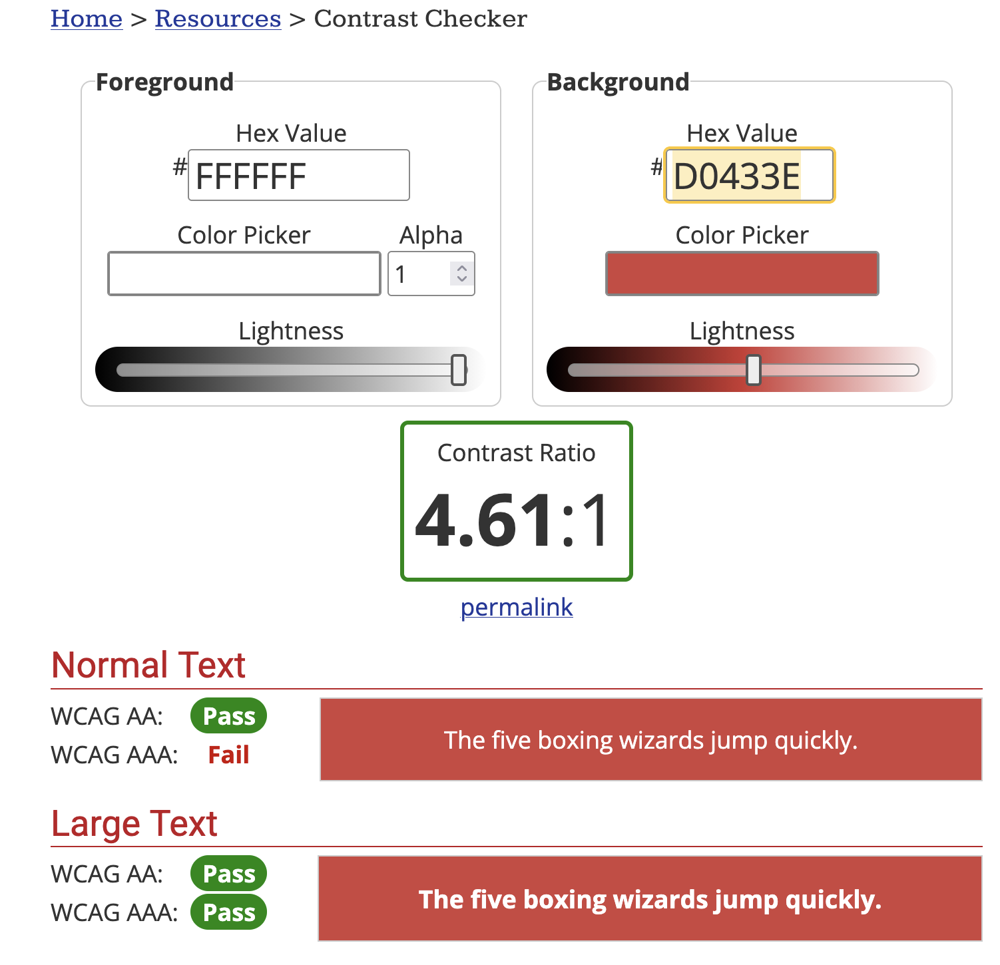
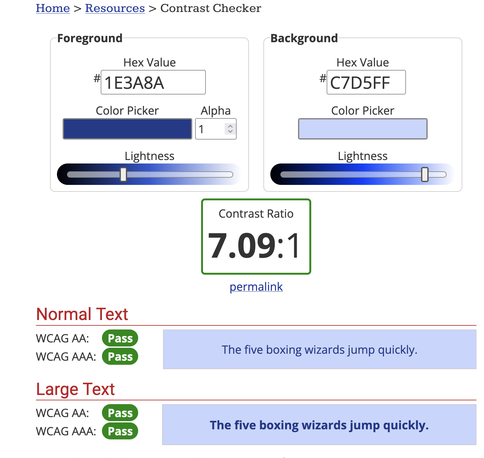
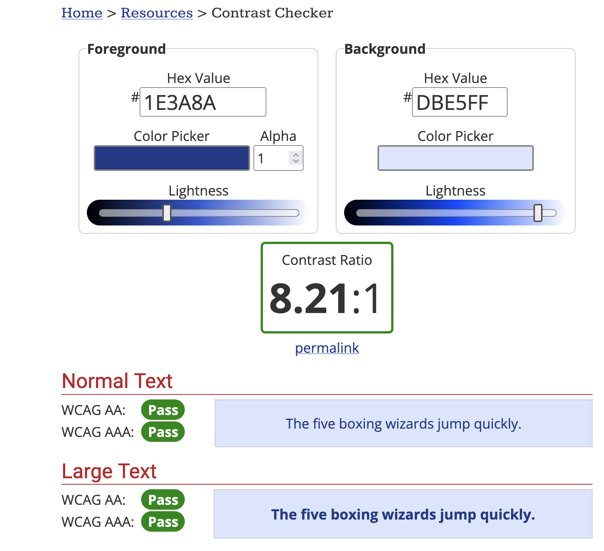
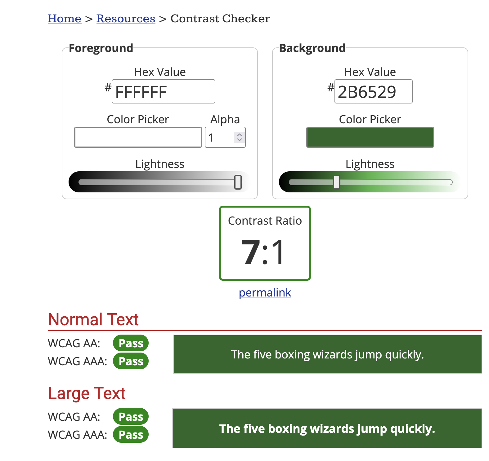
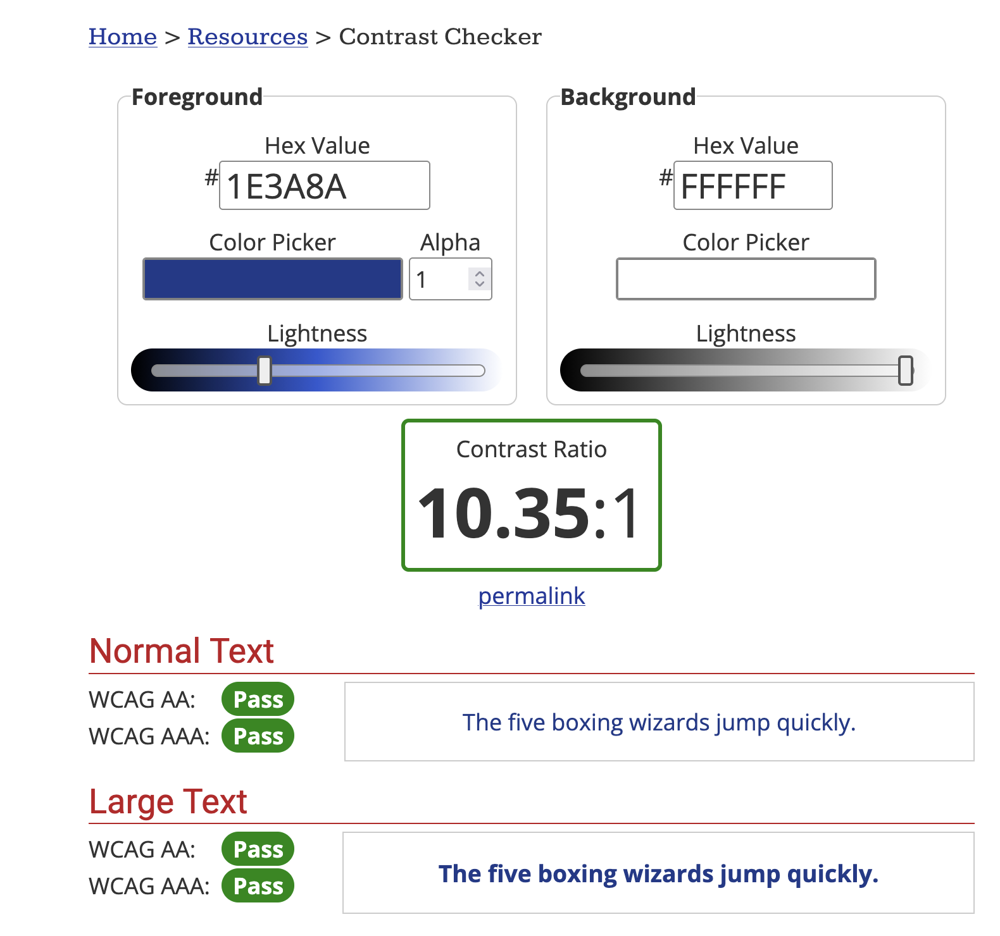
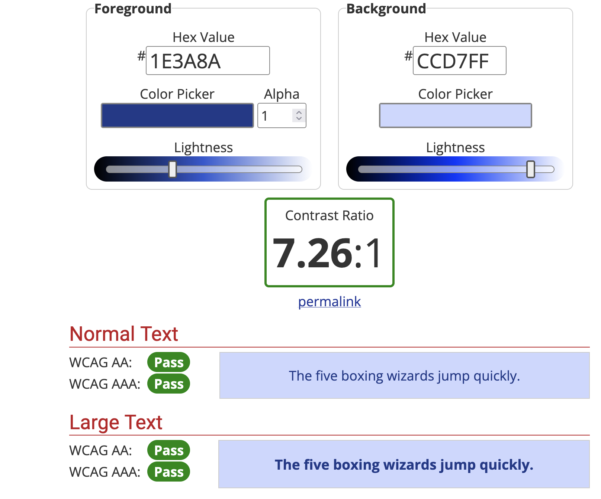
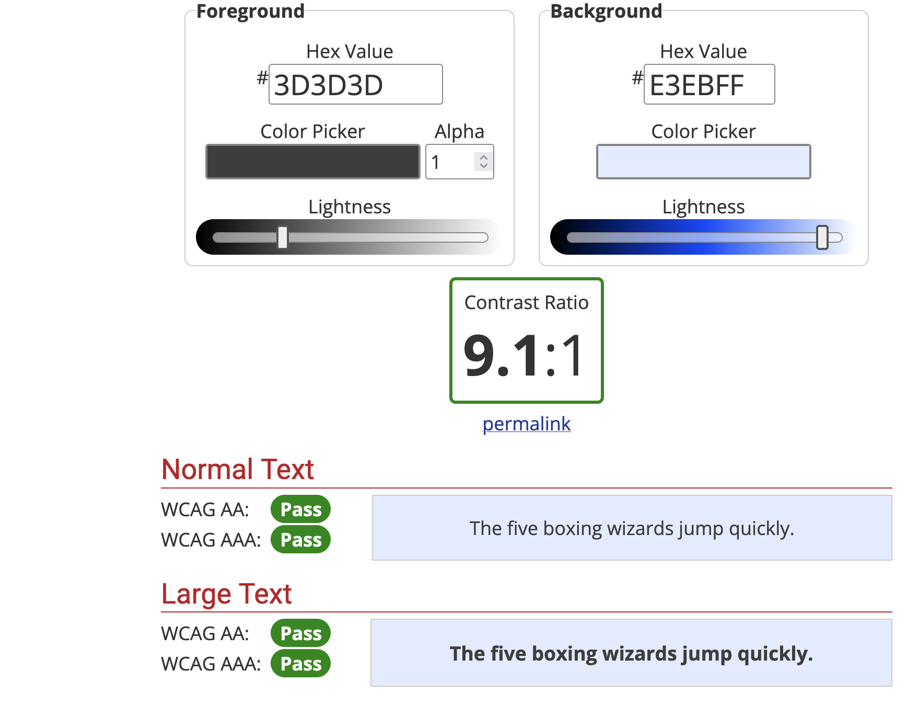
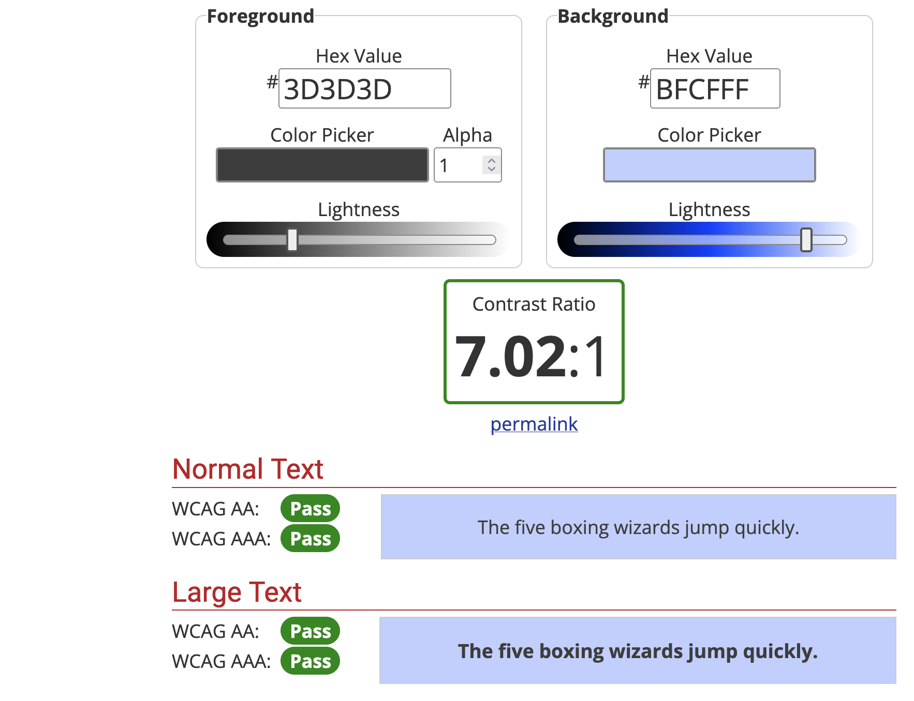

# Rapport de contraste

Voici les différents rapports fait sur Contrast Checker:

## Rapport 1

## Rapport 2

## Rapport 3

## Rapport 4

## Rapport 5

## Rapport 6

## Rapport 7

## Rapport 8

## Rapport 9

---

## Retour

[← Retour à l’accueil](index.md)
