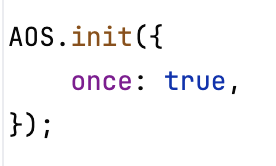
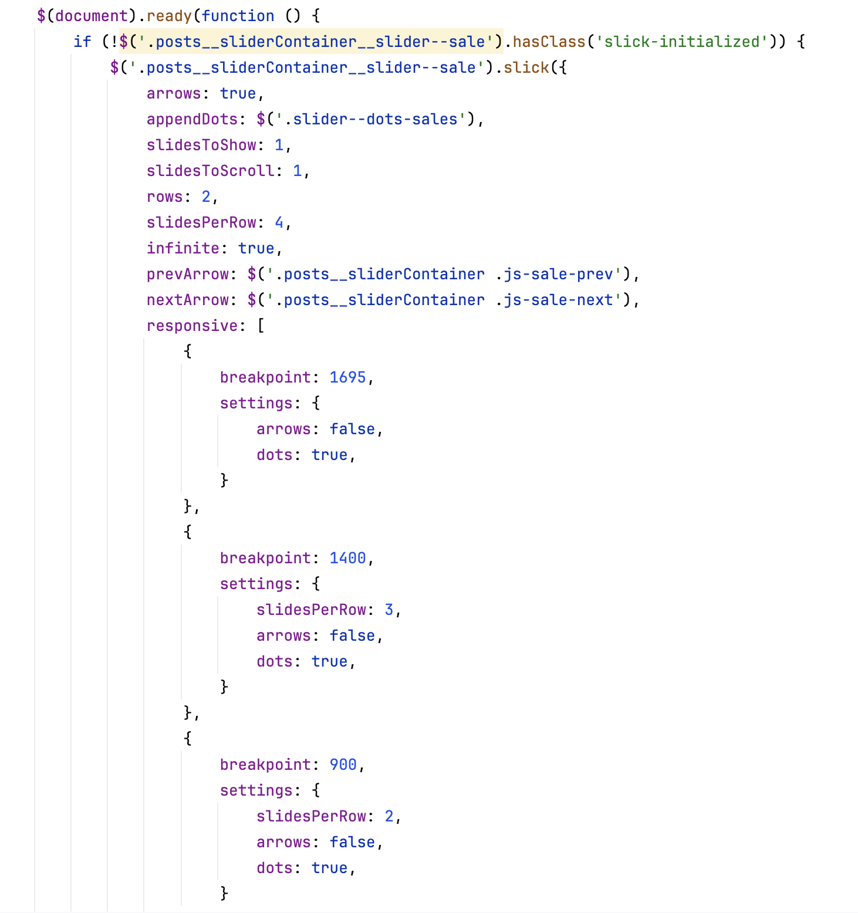
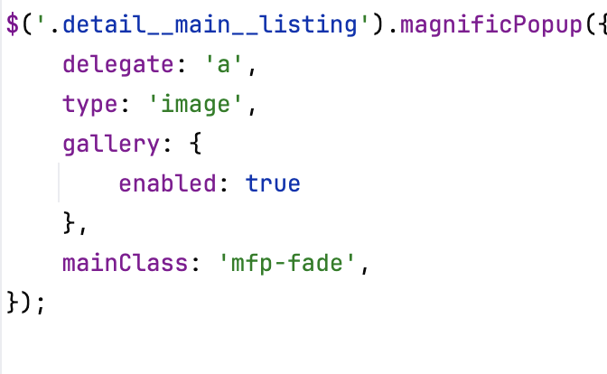
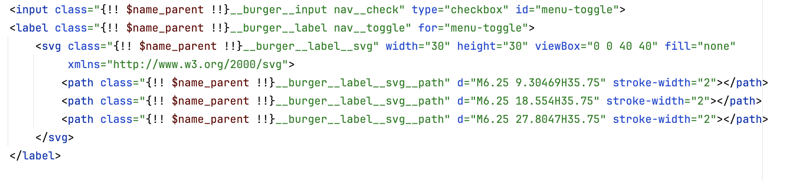

# JavaScript et dégradation gracieuse

Voici les différents apports fait en JavaScript pour ajouter un plus à l'utilisateur : 

## Ajout d'animations sur le site public

## Ajout de slider sur les pages index des annonces dans la partie utilisateur

## Ajout d'une galerie pour les photos des annonces

## Utilisation d'un burger menu sans obligation d'avoir JavaScript

---

## Retour

[← Retour à l’accueil](index.md)

