# Checklist Opquast

Voici les différentes règles que mon site couvre : 

## Contenus 
- Règle n° 2 - Les informations relatives aux droits de copie et de réutilisation sont disponibles depuis toutes les pages.  
  Il y a 3 pages textes qui sonr disponibles via le footer :
  - Mentions Légales ;
  - Conditions d'utilisations ;
  - Politique de confidentialité.
    
- Règle n° 3 - Le code source de chaque page contient une métadonnée qui en décrit le contenu.  
  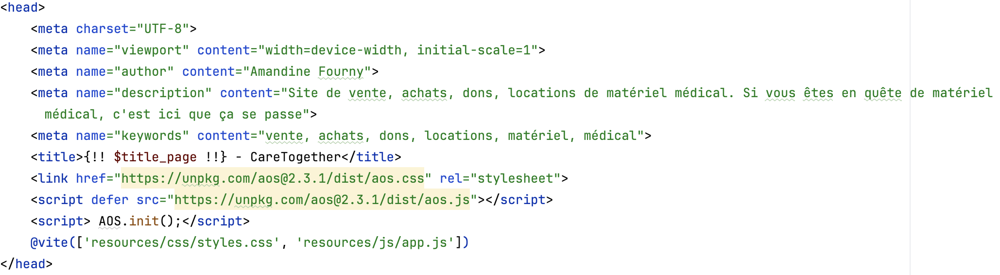
  
- Règle n° 4 - Les dates sont présentées dans des formats explicites.  
  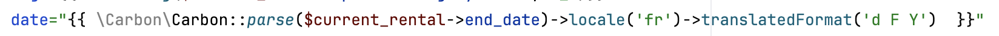

---

## E-commerce
- Règle n° 65 - Les produits indisponibles font l'objet d'une différenciation visuelle et textuelle.  
  Il y a un petit panneau 'VENDU', 'LOUER'... sur les articles qui ne sont plus disponibles.  
  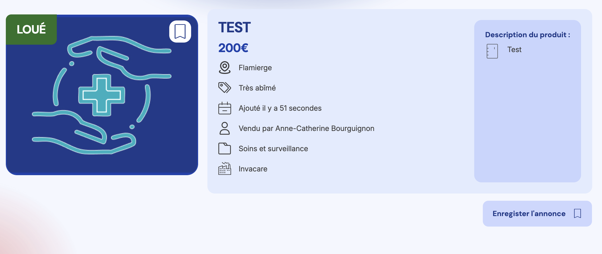
  
- Règle n° 68 - La provenance des produits est indiquée.  
  Pour chaque article, il y a la localité du vendeur et donc d'où il provient.  
  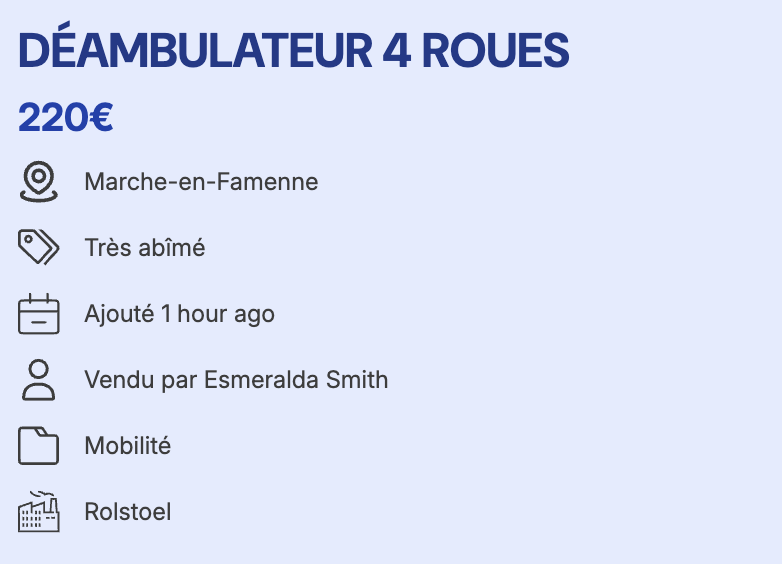

---

## Identification et contact
- Règle n° 101 - L'identité de l'auteur, de la société ou de l'organisation est indiquée.  
  Mon nom est disponible sur le footer dans la partie publique.  

- Règle n° 102 - Le titre de chaque page permet d'identifier le site.  
  Pour chaque page, il y a le nom de la page, accompagné du nom du site.  
  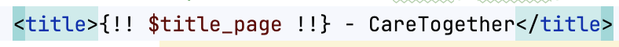

- Règle n° 107 - Au moins deux moyens de contact sont proposés.   
  Dans le footer il y a mon numéro de téléphone et mon email. On peut également me contacter via le formulaire sur le site.  

- Règle n° 113 - Il existe au moins un moyen de contacter le modérateur des espaces publics.   
  Il y a le formulaire de contact accessible pour toutes demandes.  

---

## Internationalisation 
- Règle n° 130 - Le code source de chaque page indique la langue principale du contenu.  
  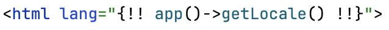

---

##Navigation 
- Règle n° 154 - La navigation ne provoque pas l'ouverture de popups.  
  La navigation ne provoque aucune ouverture de popups.  

- Règle n° 156 - Chaque page affiche une information permettant de connaître son emplacement dans l'arborescence.  
  Un breadcrumb/fil d'ariane est disponible sur chaque page.  
  

- Règle n° 157 - Les items actifs de menu sont signalés.  
  Une couleur et une aille de police diffèrent pour l'item actif.  
  

- Règle n° 165 - Le focus clavier n'est ni supprimé ni masqué.  

- Règle n° 166 - La navigation au clavier permet d'interagir avec l’intégralité des contenus et services.  
  Chaque élément nécessitant une action est disponible au clavier.  

- Règle n° 167 - La navigation au clavier s'effectue dans un ordre prévisible.  
  Elle suit l'ordre de la page :
  - De gauche à droite ;
  - De haut en bas.
 
- Règle n° 168 - Un moteur de recherche interne est proposé.  
  Un champ de recherche est disponible sur toutes les pages.  

- Règle n° 170 - Il est possible de relancer une recherche depuis sa page de résultats.  
  Le formulaire reste disponible même sur la page résultats.  

---

## Présentation 
- Règle n° 180 - La charte graphique est cohérente sur toutes les pages.  
  Sur toutes les pages, on peut retrouver un fond bleuté, des nuances de bleu et des buttons corail.  

- Règle n° 181 - L'information n'est pas véhiculée uniquement par la couleur.  
  On peut également différencier les informations avec la taille de police mais aussi le graisse.  

- Règle n° 182 - Les contenus sont présentés avec un contraste suffisant par rapport à leur arrière-plan.  
  Les contrastes passent tous que ce soit avec Contrast Checker ou Lighthouse.  
  [Voir la partie sur les contrastes](contraste.md)

- Règle n° 185 - Un contenu qui doit être restitué dans un lecteur d'écran ne lui est pas dissimulé.  
  Le voiceOver parcourt les élémens nécessaires.  

- Règle n° 186 - La taille des éléments cliquables est suffisante.  
  Un padding est mis sur les boutons pour avoir une zone plus grande.  
  

- Règle n° 190 - Une famille générique de police est indiquée comme dernier élément de substitution.  
  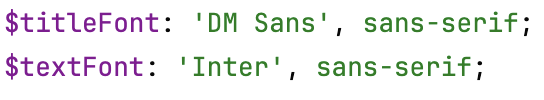

- Règle n° 191 - Les styles ne justifient pas le texte.  
  Aucun text n'est justifié avec 'text-align'.  

- Règle n° 192 - Les mises en majuscules à des fins décoratives sont effectuées à l'aide des styles.  
  'text-transform : uppercase' est utilisé pour mettre le texte en majuscule.  

- Règle n° 194 - Un ou plusieurs mécanismes dédiés à l’adaptation aux terminaux mobiles sont proposés.  
  Le site est est responsiv sur chaque terminal grâce à ces breakpoints.  
  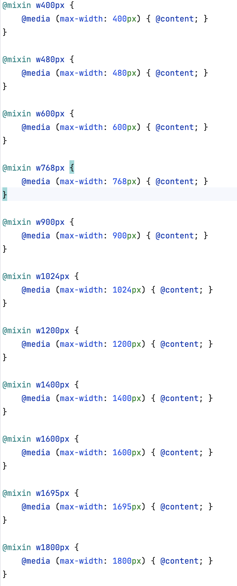

---

## Structure et code 
- Règle n° 232 - Le code source de chaque page contient une métadonnée qui définit le jeu de caractères.  
  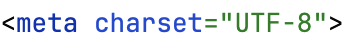

- Règle n° 233 - Le codage de caractères utilisé est UTF-8.  
  

- Règle n° 234 - Le contenu de chaque page est organisé selon une structure de titres et sous-titres hiérarchisée.  
  L'outline du site est correcte.  
  [Voir la partie sur la qualité du code HTML](qualitycode.md)

- Règle n° 236 - Chaque identifiant HTML n'est utilisé qu'une seule fois par page.  

--- 

## Données personnelles

- Règle n° 15 - La politique de confidentialité et de respect de la vie privée est disponible depuis toutes les pages.  
  Il y a 3 pages textes qui sonr disponibles via le footer :  
  - Mentions Légales ;
  - Conditions d'utilisations ;
  - Politique de confidentialité.
 
- Règle n° 23 - Il est possible de se déconnecter des espaces privés.  
  Un bouton de déconnexion est disponible.  

- Règle n° 28 - Les données sensibles ne sont pas transmises en clair dans les URL.  
  La méthode POST est utilisée dans les formulaires nécessaires.  

---

## Formulaires 
- Règle n° 69 - Chaque champ de formulaire est associé dans le code source à une étiquette qui lui est propre.  
  Pour chaque input, textarea ou autre, il y a un label visible.  
  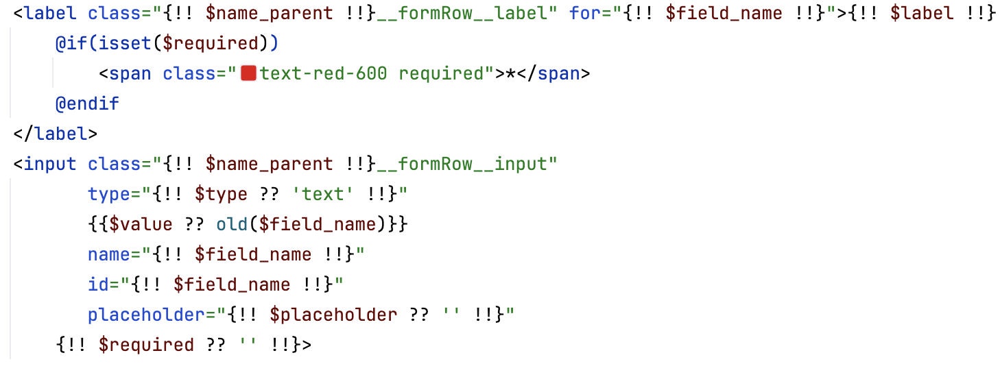

- Règle n° 71 - L'étiquette de chaque champ de formulaire indique si la saisie est obligatoire.  
  Une astérix est mise si le champ est obligatoire.  
  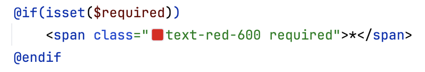

- Règle n° 76 - Les caractères saisis dans un champ de mot de passe peuvent être affichés en clair.  
  Une icône est disponible pour voir ou cacher le mot de passe.  

- Règle n° 77 - Chaque étiquette de formulaire est visuellement rattachée au champ qu'elle décrit.  
  Soit elle est au dessus et plus proche du champ correct que du précédent. Ou alors c'est encadré par une couleur pour distinguer chaque champ.  
  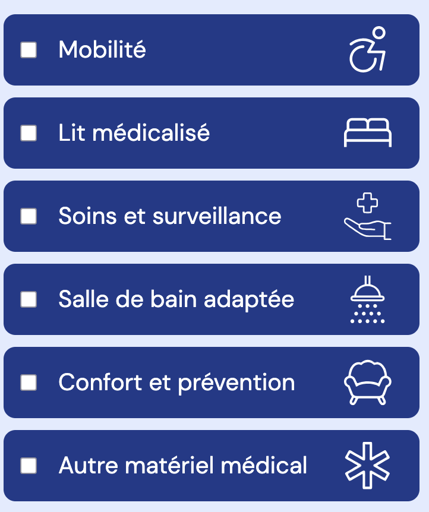
  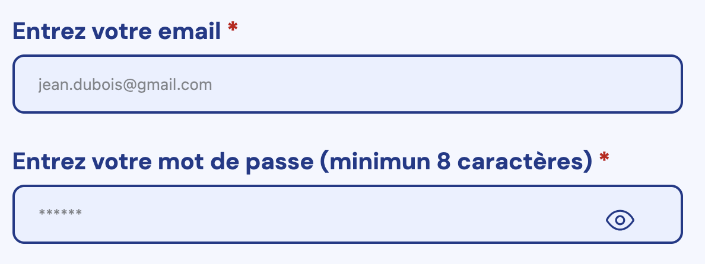

- Règle n° 80 - En cas de rejet des données saisies dans un formulaire, les raisons du rejet sont indiquées à l'utilisateur.  
  Un message d'erreur est mis en dessous du champ correspondant.  
  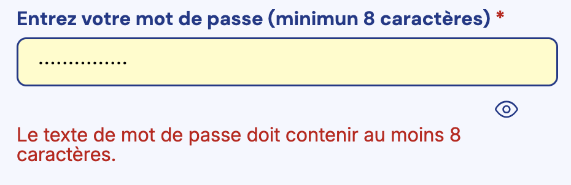

- Règle n° 85 - La soumission d'un formulaire est suivie d'un message indiquant la réussite ou non de l'action souhaitée.  
  Pour le formulaire de contact, il y a une phrase de succès.  
  

---

## Liens 
- Règle n° 136 - Chaque lien est doté d'un intitulé dans le code source.  
  Chaque balise 'a' contient un title ou alt.   
  
- Règle n° 140 - Les liens sont visuellement différenciés du reste du contenu.  
  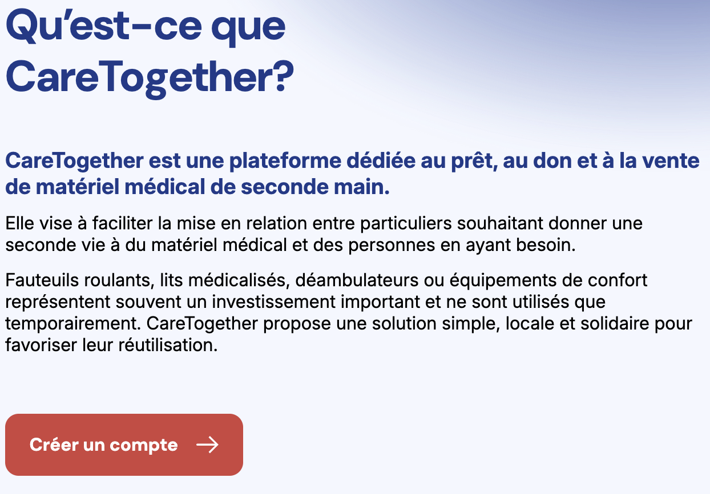
  
---

## Serveur et performances 
- Règle n° 222 - Le serveur envoie un code HTTP 404 pour les ressources non trouvées.  
  Une vue '404' est envoyée pour les ressources non trouvées.  
  
- Règle n° 224 - Le serveur envoie une page d'interdiction 403 personnalisée.  
  Une vue 'non-autorisé' est personnalisée.  
  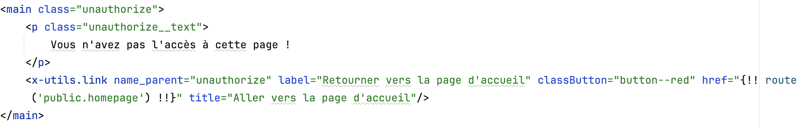

--- 

## Sécurité 
- Règle n° 197 - Toutes les pages utilisent le protocole HTTPS.  

- Règle n° 202 - Les mots de passe peuvent être choisis ou changés par l'utilisateur.  
  L'utilisateur peut choisir le mot de passe qu'il veut pour s'inscrire puis il peut le modifier sur son profil.  

- Règle n° 204 - Les mots de passe peuvent être réinitialisés.  
  Des formulaires et mails de réinitilisation sont disponibles via le formulaire de connexion.  
  

- Règle n° 205 - Les mots de passe ne sont pas communiqués en clair.  
  Lors de la réinitialisation du mot de passe, il n'est pas envoyé en clair.  

  

## Retour

[← Retour à l’accueil](index.md)
