# Performance côté serveur

Voici les différents rapport venant de la laravel debugbar.  Au début de partais avec une centaine de requête et j'ai pu diminuer le nombre. 

## Page d'acceuil
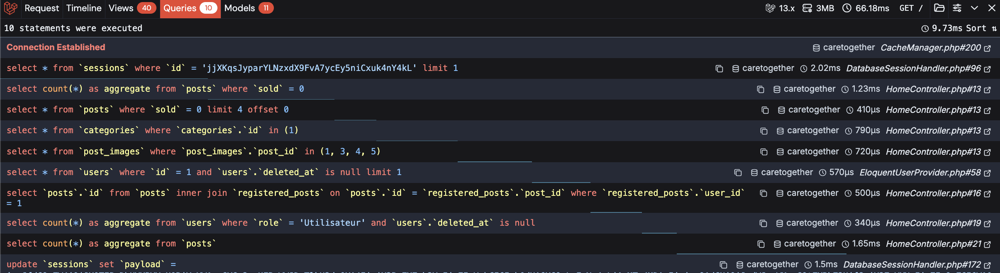

## Page d'annonces
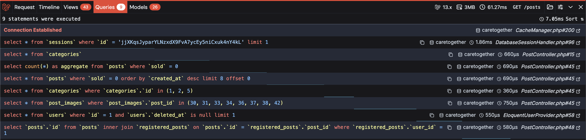

## Page détail d'annonce
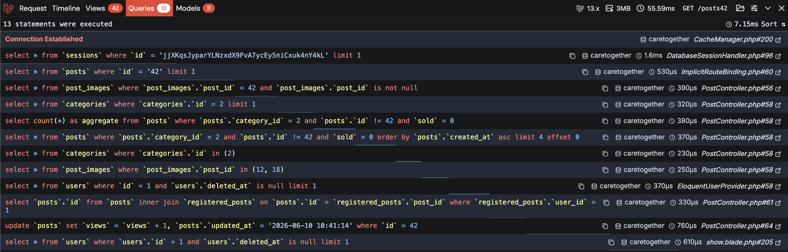

## Page à propos
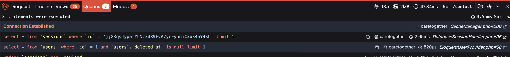

## Page de contact
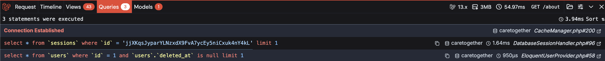

---

## Page dashboard de l'utilisateur
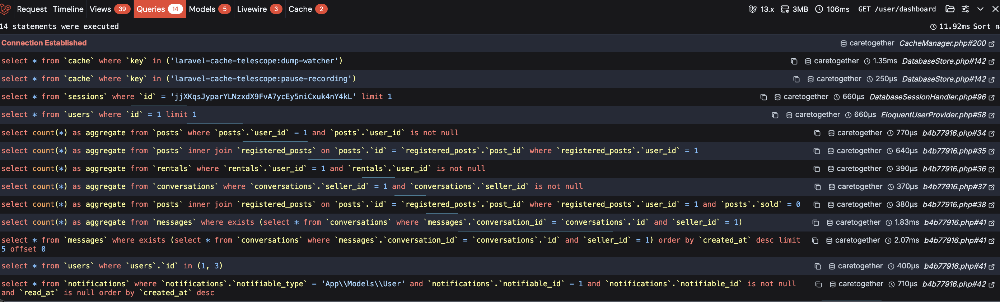

## Page d'annonces de l'utilisateur
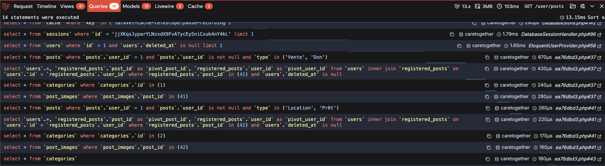

## Page détail d'annonce de l'utilisateur
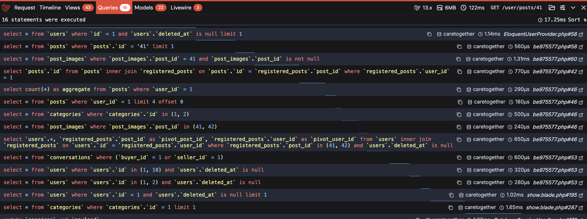

## Page des achats
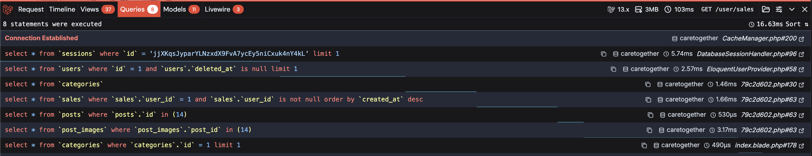

## Page des locations
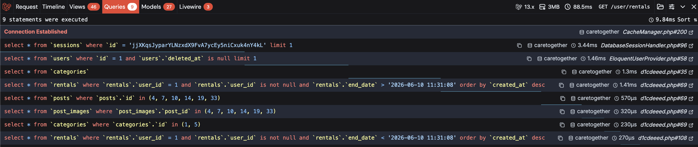

## Page des annonces enregistrées
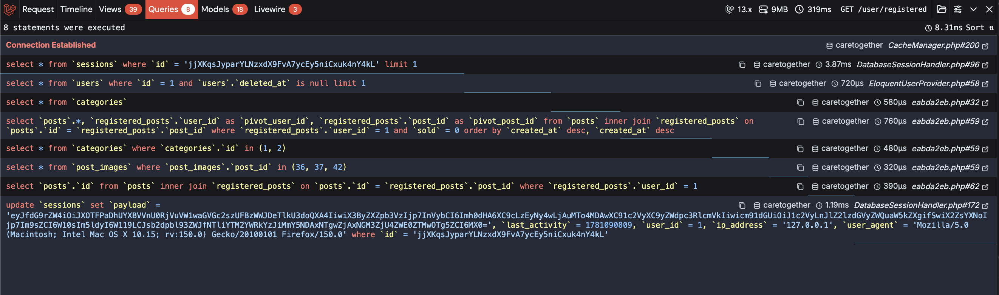

## Page des messages de l'utilisateur
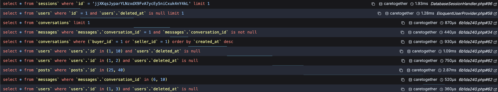

---

## Page dashboard de l'administrateur
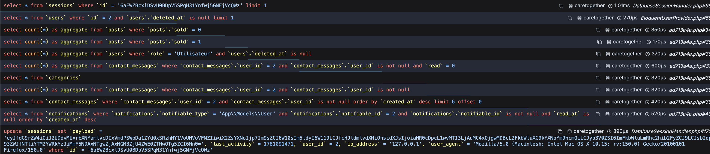

## Page des messages de l'administrateur
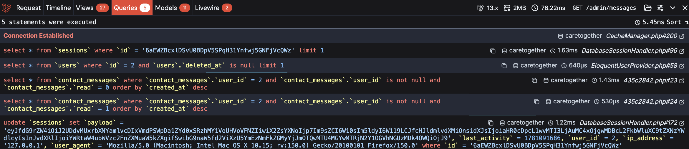

## Retour

[← Retour à l’accueil](index.md)
