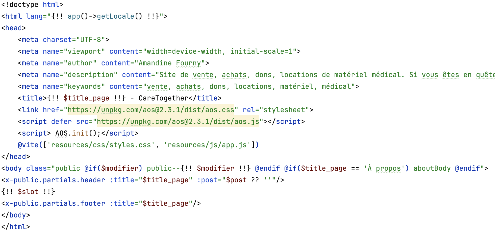
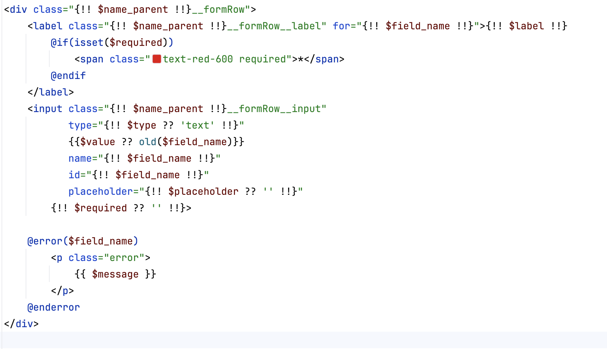
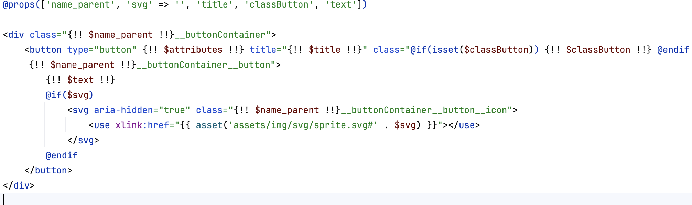
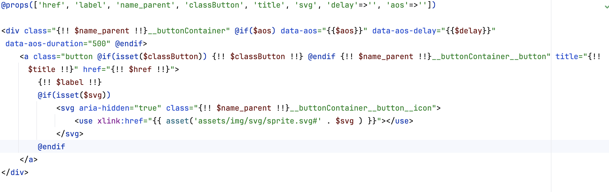
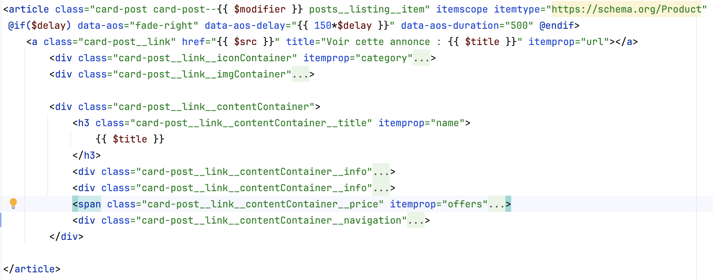
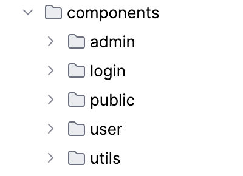
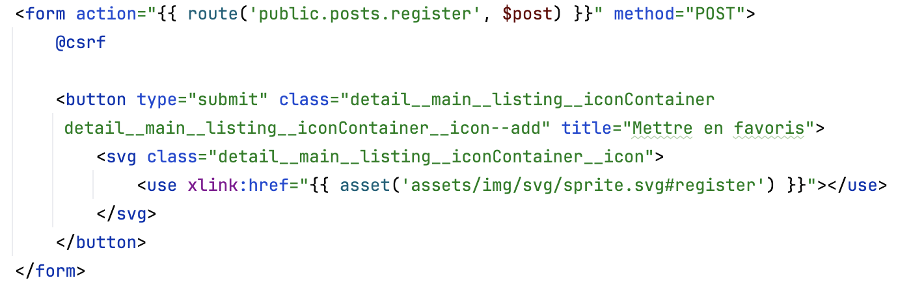

# Qualité du code HTML

Voici les différents rapport qui attestent de la qualité du code HTML:

---

## Headings Map

### Accueil

### A propos

### Contact

### Annonces

### Détail

### Mentions légales

### Politique de confidentialité

### Conditions d'utilisation

---

## Validation HTML

### Accueil

### A propos

### Contact

### Annonces

### Détail

---

## Efforts pour la sémantique
Tout d'abord chaque page du site public est validée niveau sémantique.  

Ensuite pour les pages publiques, un composant est utilisé pour avoir une cohérence. Dans ce composant, il y a le head, header, main et footer. 

Chaque input des formulaires de connexion, inscription, contact est accompagné de son label et connecté à celui-ci. Un composant est utilisé pour garder la même structure.  

Chaque call to actions a la balise adéquate :  
- Quand il y a une redirection, la balise 'a' est utilisée avec l'href correspondant
- Quand il n'y a pas de redirection, juste une action, c'est un bouton de type button qui est utilisé
- Pour les formulaires, c'est un bouton de type submit

Les annonces qui sont dans les pages d'index (achats, locations, annonces, accueil...) sont des articles avec un titre, en général h3, qui correspond.   
  

J'ai une liste de composants séparée en fonction des différentes parties du site que j'utilise pour construire le site. Ça me permet d'avoir une cohérence pour la sémantique. 
  

Chaque formulaire est dans une balise form avec un csrf. 
  

---

## Micro-datas

### Détail d'une annonce

### Liste des annonces

### Carte d'une annonce

---

## Retour

[← Retour à l’accueil](index.md)
