# Qualité du code HTML

Voici les différents rapport qui attestent de la qualité du code HTML:

---

## Headings Map

### Accueil
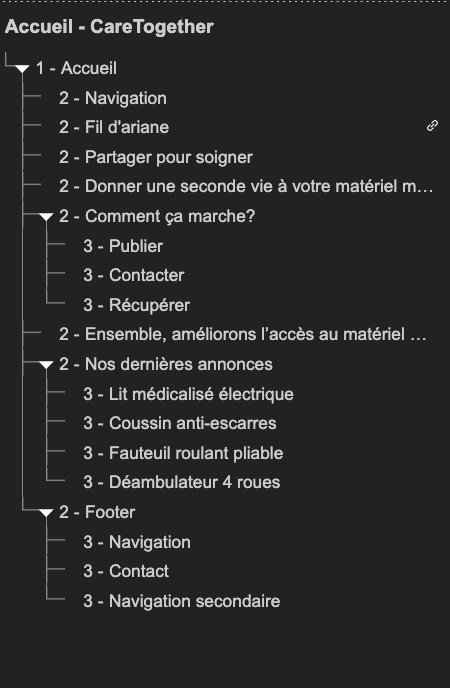
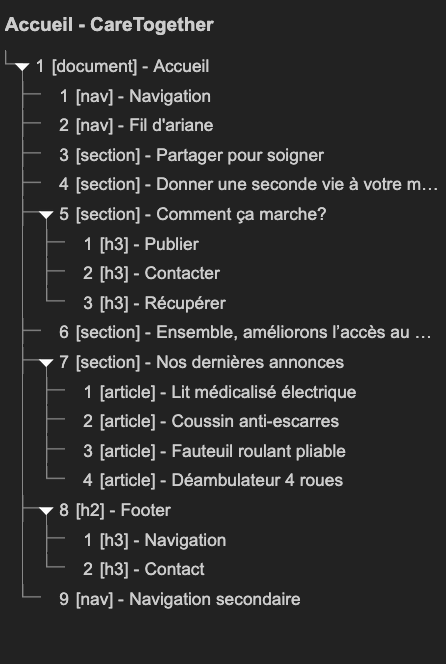

### A propos
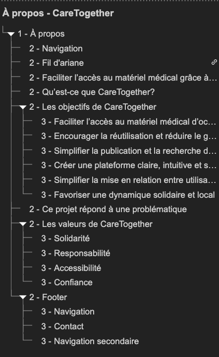
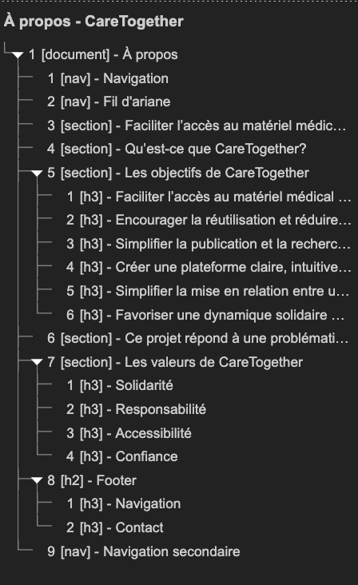

### Contact
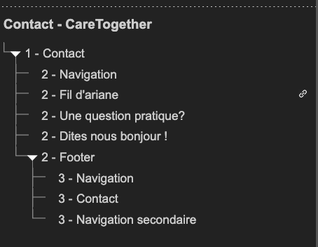
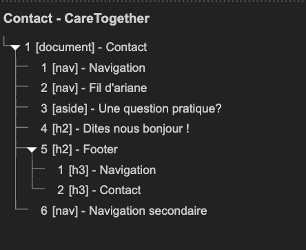

### Annonces
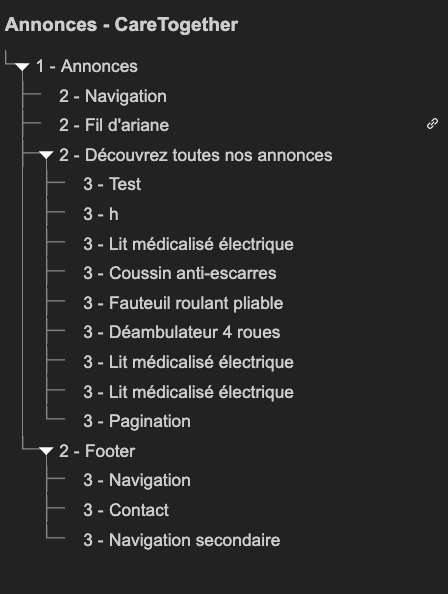
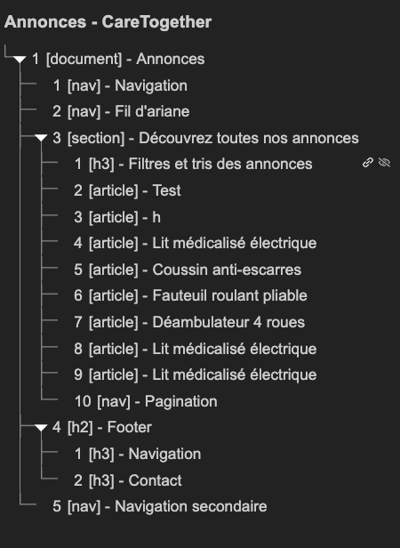

### Détail
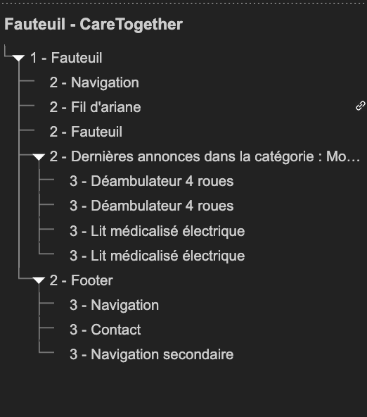
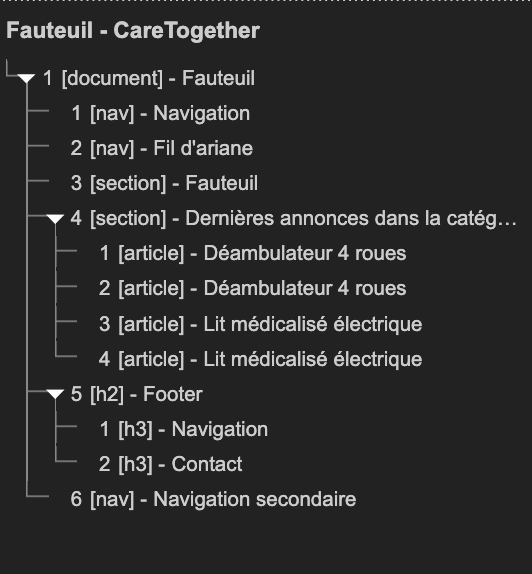

### Mentions légales
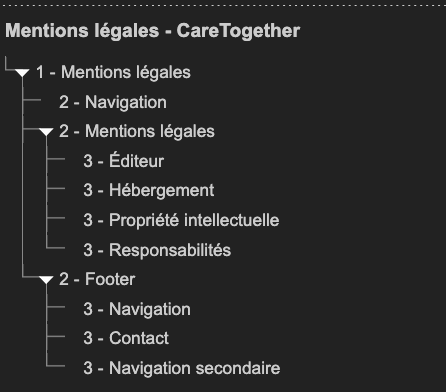
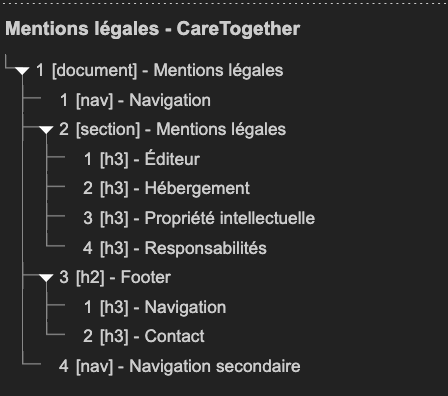

### Politique de confidentialité
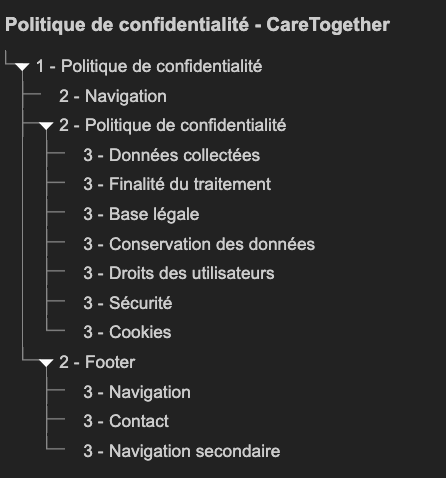
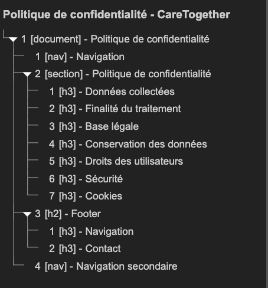

### Conditions d'utilisation
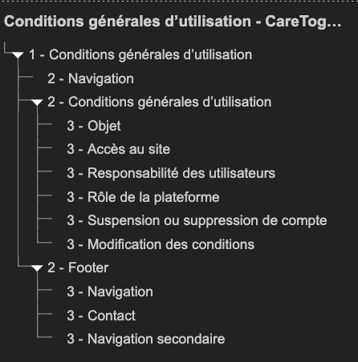
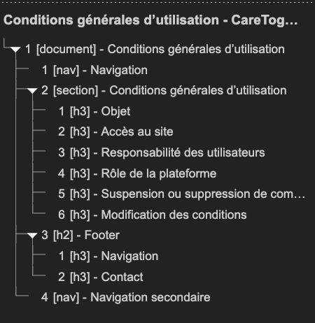

---

## Validation HTML

### Accueil
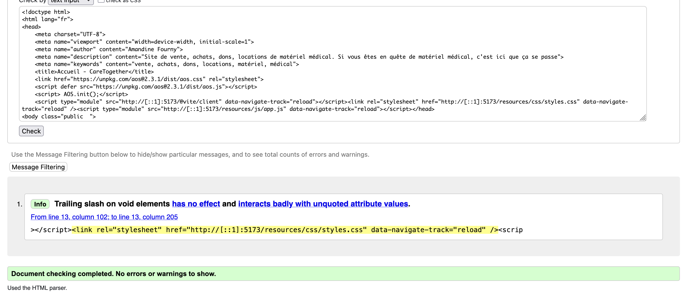

### A propos
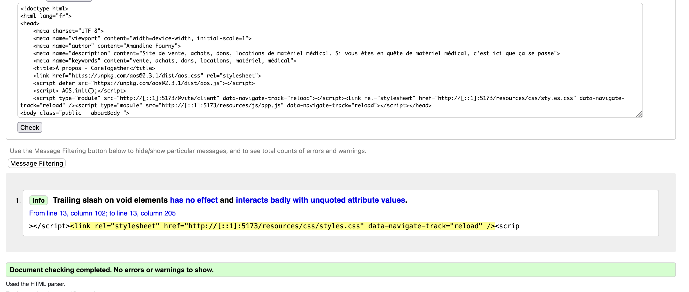

### Contact
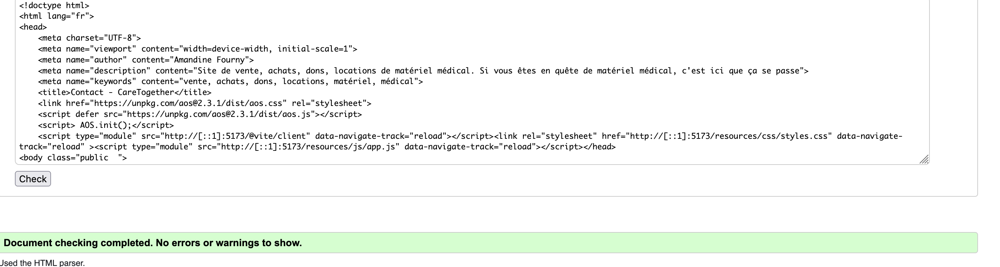

### Annonces
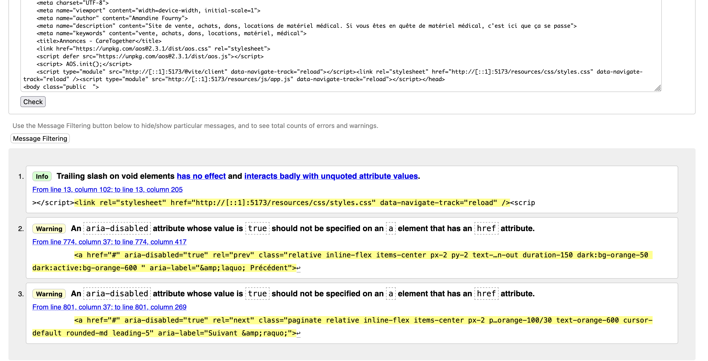

### Détail
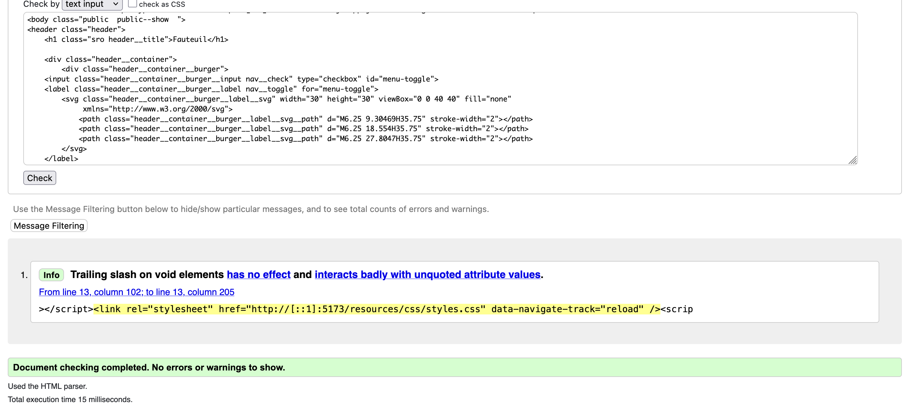

---

## Efforts pour la sémantique

---

## Micro-datas

### Détail d'une annonce
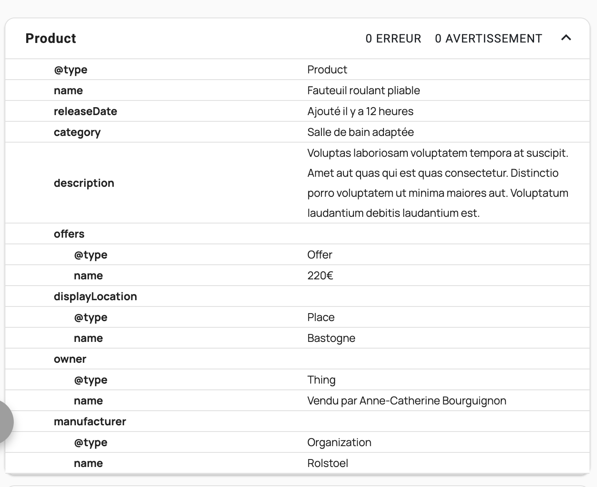

### Liste des annonces
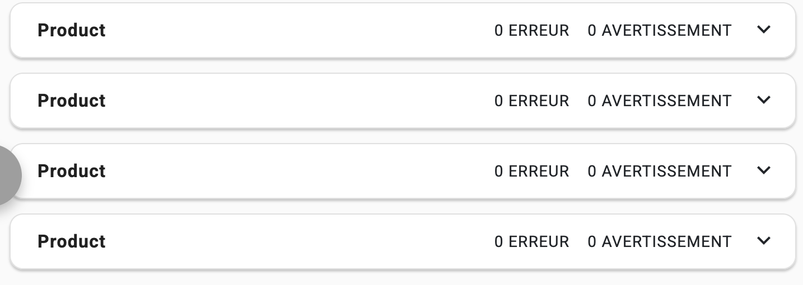

### Carte d'une annonce
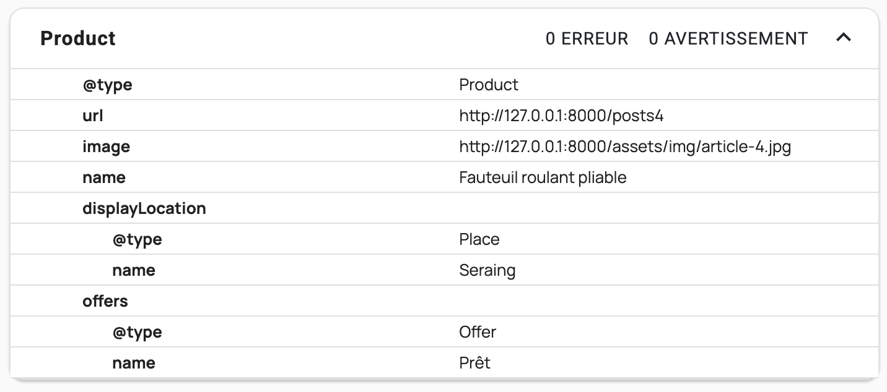

---

## Affichage des images

---

## Retour

[← Retour à l’accueil](index.md)
